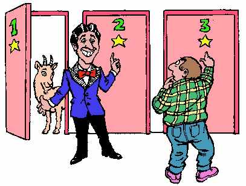

# Monte-Hall-Problem-Model
monte carlo simulation with multi-processing

### Project description
**Monte Hall problem** is a famous problem in probability based on a game show. It has generated much controversy due to the non-intuitive nature of the solution. The objective of this mini project is to write a simulation of the game that empirically demonstrates the accepted solution is indeed the correct solution. 



### Project structure
This project contains the following files:

* `player.py` - contains **Player** class which defines the switch strategy and has functions to choose a door and whether or not to switch.

* `game.py` - contains **Game** class which has a **playGame** function to play the game.

* `main.py` - play the game in a loop of *10,000,000* times from **main** and approximate probability of winning with your chosen strategy (*stay* or *switch*).

* `timer.py` - contains **Timer** class to record time.

### Concurrency
In the `main.py`, I also make **Monte Hall** simluation achieve **multi-processing**. I create and initialize five processes first, and execute all five processes, giving each process 1/5 of the total simulations (2,000,000 each). Then combine the five returned results lists and take the average, to get the overall result. Next, I try to decrease/increase the number of processes to determine the optimal runtime. The following are my tested results:
```
    num_processes = 1:  93.6119999886 s
    num_processes = 5:  12.996999979 s
    num_processes = 10: 11.8120000362 s
    num_processes = 15: 10.9649999142 s
    num_processes = 17: 11.1519999504 s
    num_processes = 20: 11.9139997959 s
    num_processes = 25: 11.5650000572 s
```
Based on my simulation test, the optimal running time number of processes is 15.


